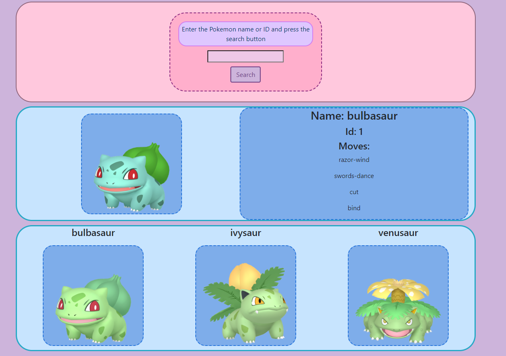

# challenge-pokemon-php

This project is pretty the same in every case to the AJAX pokedex but it is made with PHP.

This is the final result.

- I used bootstrap grid in this project
- `@file_get_contents` is used to fetch from API
- I fetch the pokemon , then based on if there is evolutions available fetch the rest and display them all.